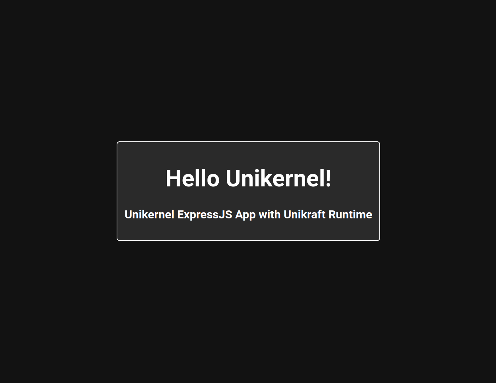

# Unikraft's Unikernel for Final Project

## Run Buildkit Container

`docker run -d --privileged --name buildkitd moby/buildkit:latest`

## Build Unikernel

`kraft build --no-cache --no-update --plat qemu --arch x86_64`

## Run Unikernel

`kraft run --rm -M 512M -p 3000:3000 --plat qemu --arch x86_64 .`
